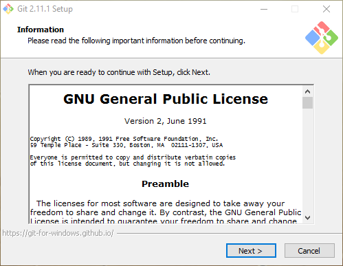

# Git

## ¿Qué es git?

Git es un sistema de control de versiones gratuito y open source diseñado por ** Linus Torvalds**. Está pensado para manejar desde pequeños projectos a grandes projectos de forma rápida y eficiente.

## ¿Cómo se instala git?

### Linux

La forma más sencilla de instalar git en Linux es a través de la terminal, haciendo uso del gestor de paquetes de la distribución en cuestión. En **Fedora**, basta con ejecutar:

```
$ sudo yum install git-all
```
Si por el contrario, queremos instalar git en una distribución basada en **Debian**, debemos ejecutar:

```
$ sudo apt-get install git-all
```

Para el resto de distribuciones puedes encontrar más información pulsando en el siguiente enlace: https://git-scm.com/download/linux


### Mac

Existen diferentes formas de instalar git en Mac.

La primera forma, y más sencilla de todas, es usando el **instalador gráfico** de git que puedes descargar [aquí](https://sourceforge.net/projects/git-osx-installer/).


Otra forma de instalar git es por línea de comandos. Si tienes instalado **Homebrew** en tu equipo, ejecuta:

```
$ sudo brew install git
```

Si prefieres instalar git por medio de **MacPorts**, ejecuta:

```
$ sudo port install git-core +svn +doc +bash_completion +gitweb

```

### Windows

Instalar git en Windows es bastante sencillo. Para ello, tenemos que dirigirnos a siguiente enlace https://git-scm.com/download/win.

Una vez hayamos pulsado sobre él, comenzará la descarga de un ejecutable. Cuando haya finalizado la descarga, lo ejecutamos y seguimos los pasos indicados en la pantalla para su instalación.



