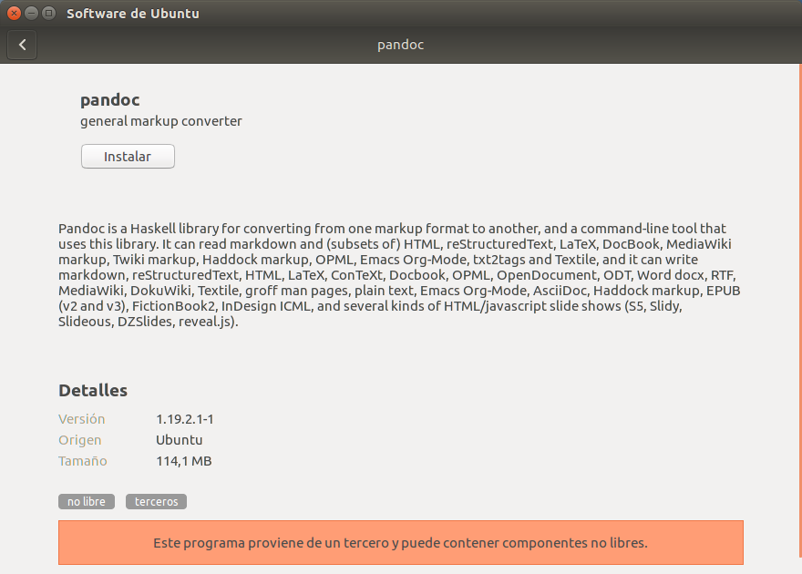
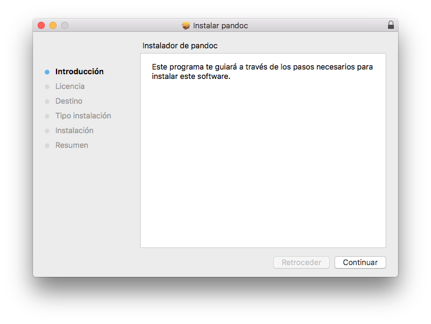
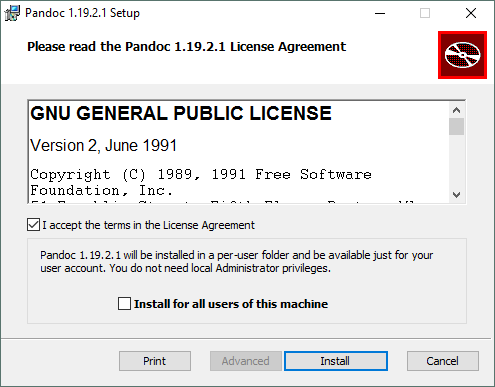

# Pandoc

## ¿Qué es Pandoc?

Pandoc es un conversor que nos permite cambiar el formato de un documento. Tiene especial relevancia su utilidad para traducir **Markdown a HTML**. No obstante, soporta otros muchos formatos, PDF, ODT, EPUB, etc.

## ¿Cómo se instala Pandoc?

### Linux

La forma más sencilla de instalar Pandoc es a través del **gestor de paquetes** de tu distribución. Está disponible en los repositorios de:

* Debian
* Ubuntu
* Slackware
* Arch
* Fedora
* NiXOS
* openSUSE
* gentoo

No obstante, las versiones de Pandoc que figuran en estos repositorios suelen estar desactualizadas.

Si estás en **Debian** o **Ubuntu** de 64-bit, puedes descargar e instalar un fichero `.deb` siguiendo este [enlace](https://github.com/jgm/pandoc/releases).

Una vez descargado, puedes instalarlo por línea de comandos:

```
$ sudo dpkg -i <nombre_paquete_descargado>
```

O gráficamente, pulsando dos veces sobre el fichero descargado:




### Mac

Para Mac disponemos de un **instalador gráfico** que puede ser descargado [aquí](https://github.com/jgm/pandoc/releases).



La segunda opción es instalar Pandoc mediante Homebrew:

```
$ sudo brew install pandoc
```
### Windows

Para instalar Pandoc en Windows basta con descargar y ejecutar el instalador que puedes encontrar [aquí](https://github.com/jgm/pandoc/releases).



## Ejemplos de uso

La forma general de convertir un formato a otro usando Pandoc es:

```
$ pandoc nombre_fichero_entrada -f formato_entrada -t formato_salida -o nombre_fichero_salida
```

### Pasar de Markdown a HTML

```
$ pandoc fichero.md -f markdown -t html -s -o fichero.html
```

En este caso hemos añadido la opción `-s` para generar un html *standalone*. De esta forma, añade al fichero de salida html, las etiquetas `html`, `head`, etc.

Por defecto, si usamos como parámetro un fichero en Markdown, Pandoc lo convierte a HTML. Por tanto, una forma equivalente de pasar de Markdown a HTML es:

```
$ pandoc fichero.md -s -o fichero.html
```

### Pasar de Markdown a PDF

```
$ pandoc fichero.md --latex-engine=xelatex -o fichero.pdf
```

### Pasar de Latex a Markdown

```
$ pandoc fichero.tex -o fichero.md
```

### Pasar de HTML a Markdown

```
$ pandoc -s -r html https://es.wikipedia.org/wiki/Markdown -o example12.md
```
### Pasar de Markdown a EPUB

```
$ pandoc fichero.md -o fichero.epub
```

### Más ejemplos

Puedes encontrar más ejemplos de conversión de formatos con pandoc [siguiendo este enlace](http://pandoc.org/demos.html).
