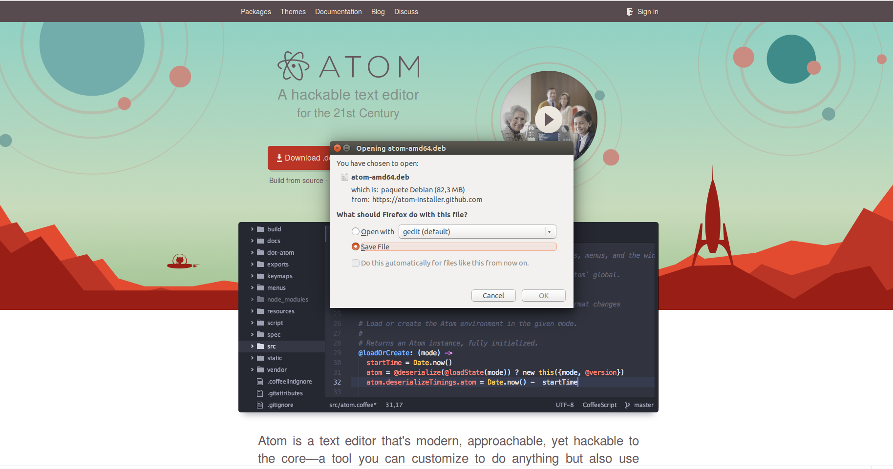
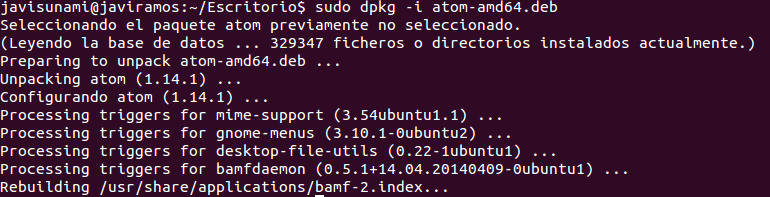

# Atom

## ¿Qué es Atom?
Es un editor de código de fuente abierta para MacOS, Linux, y Windows con soporte para plug-ins escrito en Node.js, incrustando Git Control, desarrollado por GitHub. Atom es una aplicación de escritorio construida utilizando tecnologias web.

## ¿Cómo se instala Atom?
Para instalar el editor de texto Atom en Linux, hay que seguir los siguientes pasos:

### 1. Ir a la página de Atom y descargar el paquete
Primero hay que descargar el paquete que se encuentra en la [página oficial de Atom](https://atom.io/).

### 2. Instalar el paquete
Para proceder a instalar el paquete, se hará uso del programa `dkpg`, que se utiliza para manejar paquetes **.deb**. Con dpkg puedes instalar, remover y obtener información sobre cualquier paquete **.deb**.

Para instalar el paquete con `dpkg` usamos la opción **-i** o **–install**. El comando a ejecutar es:

  * `dpkg -i <nombre_paquete_descargado>`  o
  * `dpkg --install <nombre_paquete_descargado>`

  

  **Nota:**  Es necesario tener privilegios de superusuario para realizar la instalación del paquete, por lo que se utiliza `sudo`.
