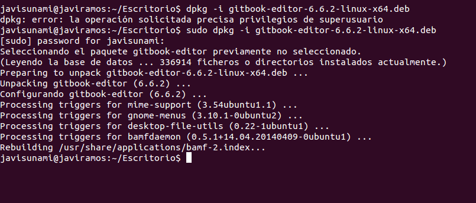

# GitBook Desktop

## ¿Qué es GitBook Desktop?
GitBook es una excelente herramienta para crear documentación de proyectos y libros técnicos usando Markdown y Git/Github. Permite incluir ejemplos y ejercicios interactivos (de momento, soporta solamente JavaScript) para posteriormente publicarlos de forma online via Github o cualquier otro hosting web.

## ¿Cómo se instala GitBook Desktop?
Para instalar GitBook Desktop en Linux hay que realizar los siguientes pasos:

### 1. Ir a la pagina de GitBook Desktop y descargar el paquete

Primero nos dirigimos a la [página oficial de GitBook Desktop](https://www.gitbook.com/editor) y descargamos el paquete que contiene todo lo necesario para su instalación.

### 2. Instalar el paquete
Para  instalar el paquete, se puede abrir el paquete con el Gestor de software correspondiente.

De esta manera sólo hay que darle al boon de instalar y ya tendrá disponible la herramienta

Otra forma de instalarlo es haciendo uso del programa `dkpg`, que se utiliza para manejar paquetes **.deb**. Con dpkg puedes instalar, remover y obtener información sobre cualquier paquete **.deb**.

Para instalar el paquete con `dpkg` usamos la opción **-i** o **–install**. El comando a ejecutar es:

  * `dpkg -i <nombre_paquete_descargado>`  o
  * `dpkg --install <nombre_paquete_descargado>`

  **Nota:**  Es necesario tener privilegios de superusuario para realizar la instalación del paquete, por lo que se utiliza `sudo`.

