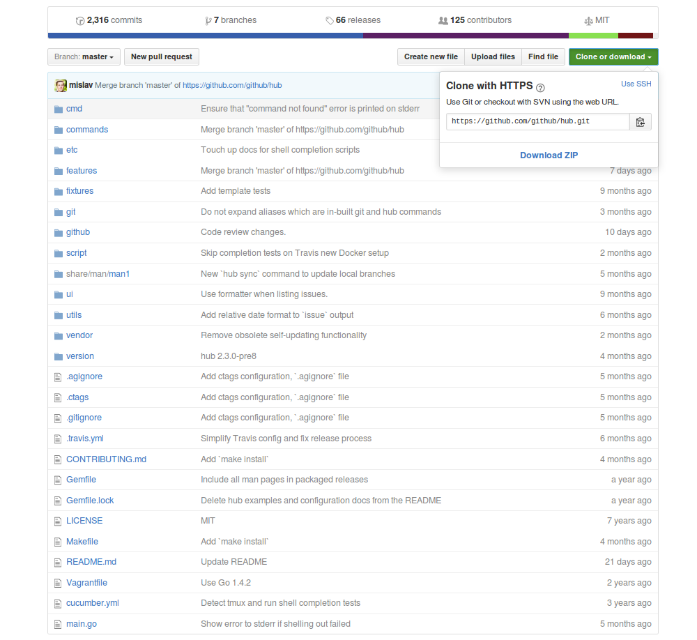
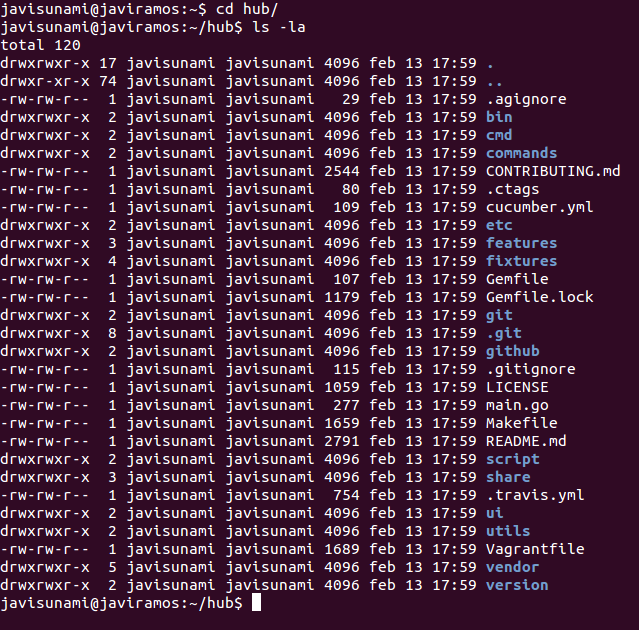
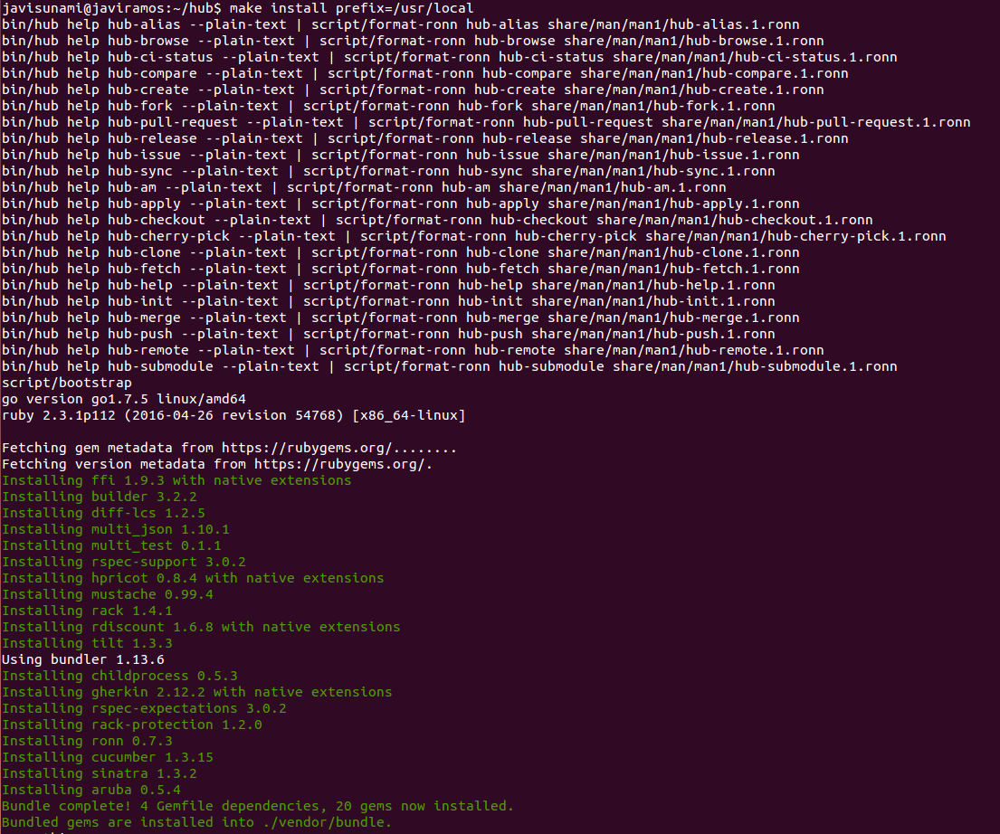

# Hub

## ¿Qué es hub?

Es una herramienta de línea de comandos que empaqueta a `git` con el objetivo de extenderlo con características y comandos adicionales que permiten que sea más fácil trabajar con **GitHub**.

## ¿Cómo se instala hub?

Para instalar hub en Linux, es necesario la dependencia `git 1.7.3` o superior y hay que proceder a realizar los siguientes pasos:

### 1. Clonar el repositorio donde se aloja hub

Primero hay que descargarse el repositorio que contiene toda la información necesaria para instalar hub en nuestro equipo. Para ello se ejecuta el siguiente comando en una terminal:
`git clone https://github.com/github/hub.git`

### 2. Acceder a la carpeta clonada
Una vez que hemos clonado el repositorio de hub alojado en GitHub, ejecutamos el comando `cd hub` para introducirnos dentro de la carpeta que contiene toda la información sobre hub

### 3. Compilación del paquete
Para poder llevar a cabo este último paso, es necesario que se encuentren instalados las siguientes dependencias:

* `make`
* [Go 1.6+](https://golang.org/doc/install)
* [Ruby 1.9+](https://www.ruby-lang.org/es/documentation/installation) con [Bundler](http://bundler.io) - Para crear las páginas de manual

El comando a ejecutar en la terminal de Linux es `make install prefix=/usr/local`. La ruta que se especifica en el argumento **prefix** determina el directorio donde se va a alojar el paquete cuando sea instalado y donde se van a buscar los archivos asociados a este paquete cuando se ejecute.

