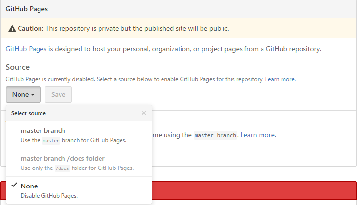

# GitHub Pages

## ¿Qué son las GH-Pages?

Las Gh-Pages es un servicio prestado por GitHub que nos permite asociar una página web a un repositorio o cuenta de usuario de dicha página. De esta forma, GitHub Pages nos permite compartir de una forma rápida y cómoda cosas como un CV, la documentación de un software, etc. con todo el mundo a través de una página web.

## ¿Cómo se usan las GH-Pages?

Debemos distinguir entre dos posibles casos:

* Sitio de usuario u organización
* Sitio de proyecto

  ### Sitio de usuario u organización
  1. **Crear un repositorio**

    Tendremos que crear un nuevo repositorio en la cuenta de Github correspondiente llamado *usuario*.github.com, siendo usuario el nombre del usuario (u organización).

  2. **Clonar el repositorio**

    Clonaremos el repositorio como haríamos con cualquier otro repositorio

    ```git clone https://github.com/username/username.github.com```

  3. **Crear la página**

    Dentro de el repositorio, crearemos la estructura de archivos a usar la página web. Es decir, los archivos HTML, CSS, JavaScript y cualquier otro que necesitemos.

  4. **Push**

    Ahora sólo quedará confirmar los cambios y empujarlos al repositorio remoto de GitHub en la rama máster.

    ```
    git add --all
    git commit -m "Commit inicial"
    git push -u origin master
    ```

  ### Sitio de proyecto

  Supondremos que queremos crear desde cero la página y que ya tenemos el repositorio en local, sincronizado con el remoto de github.

  1. **Crear la rama gh-pages**

    No necesitamos que la rama incluya commits que no estén relacionados con la web a desplegar, por tanto, crearemos una rama huérfana.

    ```git checkout --orphan gh-pages```

  2. **Crear la página**

    Dentro de el repositorio, crearemos la estructura de archivos a usar la página web. Es decir, los archivos HTML, CSS, JavaScript y cualquier otro que necesitemos.

  3. **Push**

      Ahora sólo quedará confirmar los cambios y empujarlos al repositorio remoto de GitHub en la rama máster.

      ```
      git add --all
      git commit -m "Commit inicial"
      git push -u origin gh-pages
      ```

  **NOTA:** Las gh-pages también pueden basarse en la rama máster y en el directorio /docs dentro de la misma, si así lo configuramos en la configuración del repositorio en GitHub.
  
