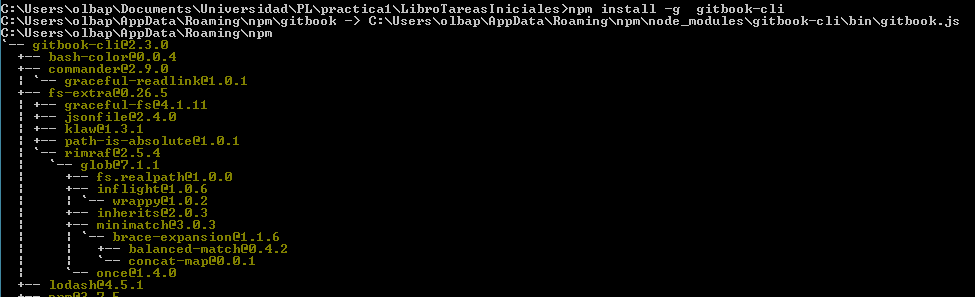
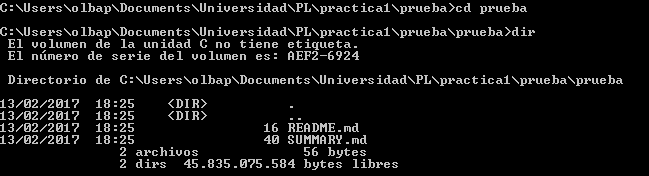
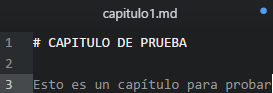
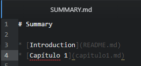
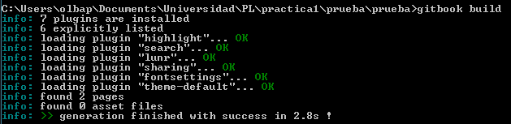
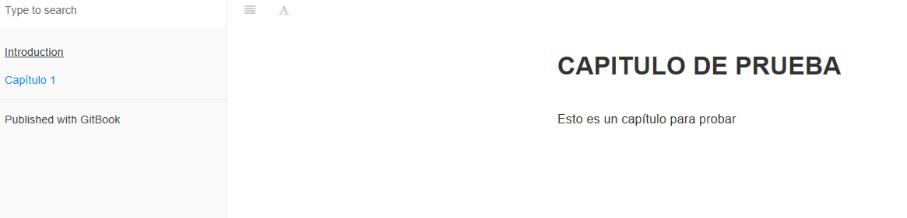
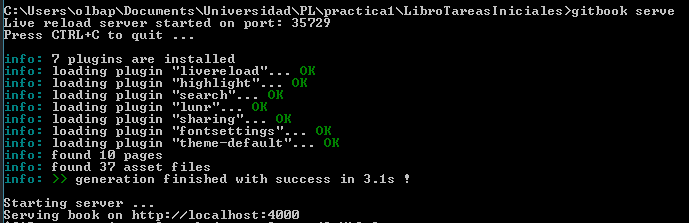
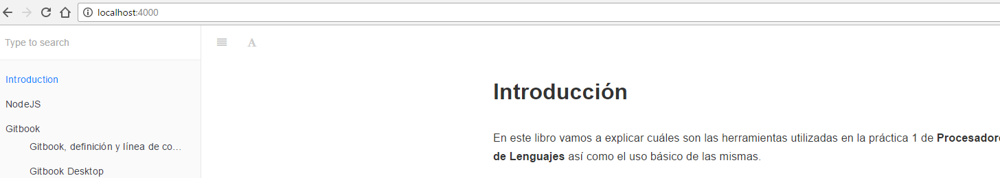

# Gitbook

## ¿Qué es Gitbook?

Es una plataforma online para escribir y alojar documentación, así como una herramienta de código abierto.

Numerosos usuarios usan esta herramienta para escribir documentación (Librerías, API, etc) o para secciones tales como las conocidas F.A.Q.(Preguntas frecuentes). Además, puede servir para publicar libros técnicos, materiales didácticos, etc.

## ¿Cómo se usa?

### Instalación de GitBook-cli

Podemos usar GitBook en su versión de línea de comandos para inicializar, construir y hacer públicos los libros que creemos, para instalarlo necesitamos tener Node.js instalado y ejecutar el siguiente comando.

```
$npm install gitBook-cli [-g]
```

**Nota:** La opción *-g* se utiliza para hacer la instalación global.



### Uso de GitBook-cli

* **Crear la estructura inicial de un libro**

  Para crear un nuevo libro, haremos uso del comando ```gitbook init nombre```, siendo nombre el nombre del libro a crear. Una vez ejecutado el comando, se nos creará la siguiente estructura.

  

  

  * SYMMARY.md : Actuá como índice del libro, indica la distribución de los capítulos.
  * README.md : Sirve como introducción al libro.

  **NOTA:** Para trabajar con GitBook usaremos Markdown, que se explicará en este libro también

* **Añadir capítulos/Editar texto**

  Como ya se dijo. Usaremos en la creación de libros con GitBook la sintaxis MarkDown.

  Los archivos se pueden organizar de la [siguiente manera](https://toolchain.gitbook.com/pages.html).

  A modo de ejemplo, añadiremos un capítulo al libro que creamos antes.

  1. Creamos el archivo *capitulo1.md* con el contenido que queramos.
  
  2. Editamos *SUMMARY.md* para añadir el capítulo que acabamos de crear.
  

* **Construir el libro (Crear HTML)**

  Una vez hayamos terminado de escribir el libro, podemos proceder a construir los HTML que lo contendrán a partir de los ficheros*.md* que hemos creado previamente. Para ello usaremos el comando siguiente:

  ```
  $gitbook build
  ```

  

  Los archivos HTML, CSS y JavaScript necesarios para la correcta visualización del libro se ubican en la subcarpeta **_book**. A continuación se muestra una captura de cómo quedó el ejemplo que hemos usado en el capítulo.

  

  **Otros formatos**

    NOTA: Se puede exportar el libro a otros formatos (```gitbook formato```) Siendo los formatos los siguientes:
    * mobi
    * epub
    * pdf


* **Servir el resultado**

  Una vez hemos creado el libro, podremos hacer que esté disponible en localhost para poder navegar correctamente por él.

  ```
  $gitbook serve
  ```

  La opción ```--port``` nos permitirá seleccionar el puerto.

  

  
