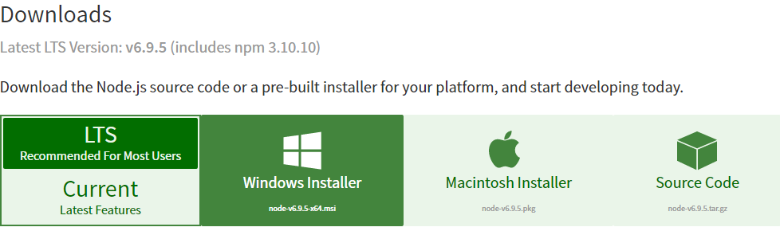
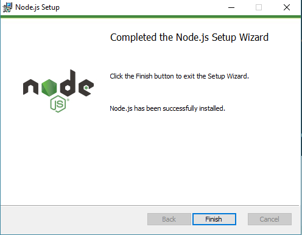
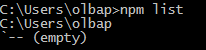
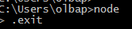
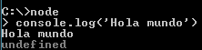
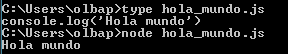

# Node.JS y npm

## ¿Qué es Node.JS?

Es un entorno de ejecución para **JavaScript**. Está diseñado para ejecutar dicho
lenguaje de programación en el lado del servidor, saliendo así del uso más conocido de JavaScript,
que es su ejecución en el navegador del cliente.

Cabe destacar que el ecosistema de paquetes de Node.js (**npm**) es el ecosistema más grande de librerías de código abierto del mundo.

## ¿Cómo se instala Node.JS?

Node.JS es multiplataforma, por tanto, los pasos dependerán del Sistema Operativo donde queramos instalarlo. En este tutorial, seguiremos los pasos para instalarlo en **Windows**.

**Para otros sistemas operativos consultar la [documentación](https://nodejs.org/en/download/) de Node.JS**

#### 1. Descargar el instalador

Desde el link anterior, seleccionaremos la versión LTS (Más estable) y damos click en Windows Installer.



#### 2. Ejecutar el instalador

Con el instalador descargados, iniciaremos su ejecución. El proceso de instalación es similar al de cualquier instalación en Windows, deberemos aceptar el acuerdo de licencia, y no será necesario cambiar ninguna de las opciones que vienen marcadas por defecto. Si se ha realizado la insalación correctamente, se mostrará lo siguiente:



#### 3. Comprobar la instalación

Para comprobar que la instalación fue exitosa, podemos intentar ejecutar node o npm desde la consola. Para ello basta con instroducir ```npm``` o  ```node```. A continuación se muestra la salida de dichos comandos.




**Con esto ya tendremos instalado Node.JS y estaría listo para ser usado**

## Uso de Node.JS

**Interfaz interactiva**

Un primer acercamiento a Node.JS puede ser por medio de una interfaz interactiva. De esta forma podremos escribir los comandos que queramos de forma similar a como se haría con Pry o Irb en RUBY.

Se usará JavaScript.

```
$node
```



**Desde archivos**

Posteriormente, podremos acercarnos al uso más frecuente de node, y es su ejecución de archivos JavaScript.

Para ejecutar un archivo JavaScript con Node.JS basta con invocar a node con el archivo pasado como argumento.

```
$node hola_mundo.js
```



## ¿Qué es npm?

Es el gestor de paquetes de Node.JS.

### Uso de npm

**Instalar módulos**

Se pueden instalar de dos formas:

* Localmente: El módulo a instalar se instalará localmente en el directorio node_modules.

  ```
  $pm install nombre_modulo
  ```

* Globalmente: Permitirá usar el módulo desde cualquier punto del sistema de archivos.

  ```
  $npm install -g nombre_modulo
  ```

  NOTAS:

  * Para añadir el módulo como dependencia se usa la opción ```--save```
  * Para añadir el módulo como dependencia de desarrollo se usa la opción ```--save-dev```

**Obtener ayuda de un módulo**

Abrirá una ventana del navegador que enlaza a la página de documentación elegida por el autor.

```
$npm docs nombre_modulo
```

**Usar los módulos**

En el código usado por Node.JS debemos usar la siguiente sintaxis:

```javascript
var modulo = require('modulo')```

A continuación, usaremos modulo como cualquier objeto.

**Instalar dependencias**

Si existe un fichero ```package.json``` que incluya las dependencias del módulo, una simple invocación de ```npm install``` instalará las dependencias necesarias.
